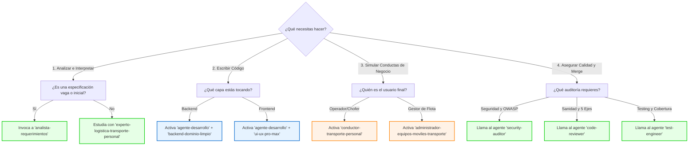

# Guía de Agentes y Habilidades de la Agencia SMT

Esta guía proporciona la documentación oficial sobre cómo interactuar, utilizar y elegir los **Agentes Especialistas** y las **Habilidades (Skills)** del proyecto. Tras la reestructuración de la carpeta `Agencia/.agent/`, los recursos están organizados de la siguiente manera:

*   **Agentes Especialistas y sus Habilidades base:** Ubicados en `Agencia/.agent/agent-skills/agents/`
*   **Habilidades de Operación SMT:** Ubicadas en `Agencia/.agent/skills SMT/`
*   **Habilidades de Desarrollo Técnico:** Ubicadas en `Agencia/.agent/skills-desarrollo/`

---

## 1. Agentes Especialistas (Personas / Roles)
Ubicados en `Agencia/.agent/agent-skills/agents/`

Los agentes representan identidades con enfoques operativos, de calidad, seguridad o análisis de requerimientos bien definidos.

### 👤 `agente-desarrollo`
*   **Propósito:** Asistente experto en la pila de tecnologías del proyecto y la arquitectura modular limpia. Garantiza que la lógica no se acople directamente a la base de datos ni a los controladores HTTP, y mantiene la coherencia visual y funcional del frontend.
*   **Stack Tecnológico Soportado:**
    *   **Backend:** Node.js, Express, TypeScript, Prisma ORM (PostgreSQL), JWT, bcryptjs.
    *   **Frontend:** React (Vite), TypeScript, Tailwind CSS, React Router DOM, Zustand (estado global), Axios (servicios API), Lucide React (iconografía) y Sonner (notificaciones).
*   **Cuándo Usarlo:** Al programar nuevas características (endpoints, componentes, vistas), refactorizar lógica de persistencia, estructurar nuevos módulos o enlazar APIs.
*   **Instrucciones Operativas y Reglas:**
    1.  **Arquitectura Backend (Clean Architecture):** Todo desarrollo backend se agrupa en `backend/src/modules/`. El controlador (`*.controller.ts`) recibe y responde peticiones HTTP; NUNCA debe invocar a Prisma. Toda la lógica de negocio y las consultas se delegan al servicio (`*.service.ts`).
    2.  **Arquitectura Frontend (Atomic Design):** Organizado en `frontend/src/modules/` para flujos lógicos y `frontend/src/components/` para UI genérica:
        *   `atoms/`: Elementos indivisibles (botones, inputs, etiquetas).
        *   `molecules/`: Combinación simple de átomos (campos con etiqueta, barras de búsqueda).
        *   `organisms/`: Secciones complejas que agrupan moléculas y átomos (headers, sidebars, tablas).
        *   `templates/`: Layouts base de estructura sin datos (AppShellTemplate).
        *   Los componentes específicos de una vista se guardan localmente en `modules/<nombre-modulo>/components/`.
    3.  **Servicios API:** Toda interacción con el backend debe realizarse en funciones exportadas desde `services/` usando Axios. Ningún componente debe realizar llamadas HTTP directas.
    4.  **Registro de Cambios Obligatorio:** Tras completar el código, el agente debe registrar detalladamente los cambios en:
        `Agencia/INFORACION DE AGNETES/documentacion de agnetes/informe de desarollo/<kebab-case-de-la-tarea>/informe.md`
        detallando archivos modificados, decisiones técnicas y pruebas de resolución.

### 👤 `analista-requerimientos`
*   **Propósito:** Especialista encargado de tomar datos crudos, notas informales, audios transcritos o especificaciones ambiguas y transformarlos en especificaciones técnicas formales y ordenadas para el equipo de desarrollo.
*   **Cuándo Usarlo:** Al inicio de cualquier requerimiento o desarrollo técnico donde la información proporcionada por el cliente sea escasa, redundante o poco estructurada.
*   **Instrucciones Operativas y Reglas:**
    1.  **Limpieza de Datos:** Elimina redundancias, asunciones no validadas y asienta claramente el problema. Resuelve ambigüedades mediante preguntas guiadas antes de escribir la especificación final.
    2.  **Estructura de Salida Obligatoria:** Crea una subcarpeta por requerimiento en:
        `Agencia/INFORACION DE AGNETES/documentacion de agnetes/Requeriminetos/<nombre-del-requerimiento-kebab-case>/`
    3.  **Generación de `requerimiento.md`:** Debe incluir las siguientes secciones:
        *   **Título y Resumen:** Nombre del requerimiento y una descripción concisa de máximo 3 líneas.
        *   **Contexto / Problema a Resolver:** Explicación del "por qué" de la necesidad de negocio.
        *   **Requerimientos Funcionales:** Casos de uso específicos, reglas de negocio y flujos paso a paso.
        *   **Requerimientos No Funcionales:** Restricciones de rendimiento, seguridad y experiencia de usuario.
        *   **Impacto Arquitectónico:** Detalle de endpoints/tablas de base de datos a modificar (Backend) y vistas/componentes atómicos/estados (Frontend).

### 👤 `code-reviewer`
*   **Propósito:** Emula la revisión rigurosa de un Ingeniero Staff Senior. Evalúa las propuestas de cambios en base a 5 dimensiones de calidad: *Correctitud*, *Legibilidad*, *Arquitectura*, *Seguridad* y *Rendimiento*.
*   **Cuándo Usarlo:** Antes del merge definitivo de una rama de características o al finalizar un desarrollo para realizar un control de calidad técnico cruzado.
*   **Marco de Revisión (Las 5 Dimensiones):**
    1.  **Correctitud:** ¿Cumple con la especificación? ¿Maneja edge cases (nulls, límites, errores)? ¿Los tests verifican el comportamiento esperado?
    2.  **Legibilidad:** ¿Es legible sin explicación adicional? ¿Nombres descriptivos y control de flujo simple?
    3.  **Arquitectura:** ¿Sigue patrones establecidos y mantiene límites modulares libres de dependencias circulares?
    4.  **Seguridad:** ¿Sanitiza inputs? ¿Fuga secretos en logs? ¿Usa queries parametrizadas?
    5.  **Rendimiento:** ¿Evita consultas N+1? ¿Tiene bucles infinitos? ¿Evita re-renders innecesarios en frontend?
*   **Instrucciones Operativas y Reglas:**
    1.  **Revisar los tests primero:** Revelan el diseño y la cobertura real del código.
    2.  **Clasificar Hallazgos:** **Critical** (bloquea merge por vulnerabilidades o fallos graves), **Important** (debe arreglarse por malas prácticas o pruebas ausentes) y **Suggestion** (mejoras de estilo u optimizaciones opcionales).
    3.  Generar el reporte bajo la plantilla estructurada oficial:
        ```markdown
        ## Review Summary
        **Verdict:** APPROVE | REQUEST CHANGES
        **Overview:** [Resumen de la valoración]
        ### Critical Issues
        - [File:line] [Descripción y recomendación de fix]
        ### Important Issues
        - [File:line] [Descripción y recomendación de fix]
        ### Suggestions
        - [File:line] [Propuesta de mejora]
        ### What's Done Well
        - [Observación positiva sobre el código]
        ### Verification Story
        - Tests reviewed: [yes/no] | Build verified: [yes/no] | Security checked: [yes/no]
        ```

### 👤 `security-auditor`
*   **Propósito:** Auditor de seguridad enfocado en la prevención de vulnerabilidades del código, mitigación de riesgos de fuga de secretos y aseguramiento de fronteras de software siguiendo directrices tipo OWASP.
*   **Cuándo Usarlo:** Al programar o refactorizar controladores con entrada de datos del usuario, controladores de autenticación, generación de tokens JWT, lógica de encriptación o consultas complejas.
*   **Alcance de la Auditoría:**
    *   **Input Handling:** Sanitización y validación de fronteras, XSS, vectores de inyección (SQL, NoSQL, Comandos).
    *   **Auth & Authz:** Robustez de hashes, manejo seguro de sesiones (cookies secure, sameSite), prevención de IDOR y control de rate limits.
    *   **Data Protection:** Almacenamiento seguro de secretos en entornos, exclusión de información sensible de logs y payloads APIs, encriptación en tránsito y reposo.
    *   **Infraestructura y Terceros:** Cabeceras CSP/HSTS, configuración CORS, auditoría de CVEs en dependencias y verificación de firmas de webhooks.
*   **Instrucciones Operativas y Clasificación:**
    1.  Clasificar hallazgos en: **Critical** (ataque remoto viable; bloquear release), **High** (exposición de datos; corregir antes de release), **Medium** (impacto limitado; corregir en sprint), **Low** (mejora teórica) e **Info** (mejores prácticas).
    2.  Proporcionar siempre una Prueba de Concepto (PoC) para vulnerabilidades críticas/altas.
    3.  Generar el reporte bajo el formato:
        ```markdown
        ## Security Audit Report
        ### Summary
        - Critical: [count] | High: [count] | Medium: [count] | Low: [count]
        ### Findings
        #### [SEVERIDAD] [Título del Hallazgo]
        - **Location:** [file:line]
        - **Description:** [Descripción del fallo]
        - **Impact:** [Qué puede lograr un atacante]
        - **Proof of concept:** [Escenario de explotación]
        - **Recommendation:** [Solución con ejemplo de código corregido]
        ### Positive Observations
        - [Prácticas seguras identificadas]
        ```

### 👤 `test-engineer`
*   **Propósito:** Especialista en aseguramiento de calidad (QA) y diseño de estrategias de testing a nivel unitario, de integración y extremo a extremo (E2E).
*   **Cuándo Usarlo:** Al definir la estrategia de pruebas de flujos de negocio complejos o al reproducir y validar un bug antes de repararlo.
*   **Instrucciones Operativas y Reglas:**
    1.  **Testing Multinivel:** Unitario (para lógica pura), Integración (para límites de componentes y llamadas de bases de datos) y E2E (para flujos críticos de usuario).
    2.  **Patrón Prove-It:** Ante un bug reportado:
        *   Escribir un test automatizado que evidencie el fallo (debe FALLAR en el código actual).
        *   Confirmar el fallo del test en consola.
        *   Reportar que el test está listo para que el agente de desarrollo implemente el fix correspondiente.
    3.  **Cobertura de Escenarios:** Validar siempre happy path, entradas vacías, límites de valores numéricos, rutas de manejo de error y comportamiento concurrente.
    4.  **Aislamiento y Mocks:** Mockear solo en los límites de sistemas externos (HTTP externo, base de datos). Evitar tests dependientes del orden de ejecución.
    5.  Generar análisis bajo el formato:
        ```markdown
        ## Test Coverage Analysis
        ### Current Coverage
        - [X] tests sobre [Y] componentes. Gaps de cobertura: [detalles]
        ### Recommended Tests
        1. **[Nombre del Test]** — [Propósito y justificación]
        ### Priority
        - Critical: [Riesgo de datos/seguridad] | High: [Lógica principal] | Medium: [Edge cases]
        ```

---

## 2. Habilidades de Operación SMT (Negocio)
Ubicadas en `Agencia/.agent/skills SMT/`

Estas habilidades capacitan al agente para entender las particularidades logísticas y de negocio exclusivas de **SMT (Soluciones de Movilidad Terrestre)**.

### ⚙️ `administrador-equipos-moviles-transporte`
*   **Propósito:** Permite actuar como el gestor de los activos físicos de transporte de SMT (flota de 300 vehículos compuesta por Autobuses Mercedes-Benz, Autobuses Volvo y Vanes Sprinter).
*   **Reglas y Directrices de Negocio:**
    *   **Mantenimiento:** Clasifica entre *Mantenimiento Preventivo* (se programa en horas valle en bodega, dura aprox. 2 horas) y *Mantenimiento Correctivo* (se reporta de urgencia en ruta, requiere inmovilizar el autobús y activa unidades de resguardo).
    *   **Combustible y Ralentí (Idle Time):** Controla el consumo y vigila descensos bruscos en los tanques (telemetría de robo). Monitorea el ralentí excesivo con una meta ideal de menos del 5% del tiempo de operación.
    *   **Capacidad de Unidades:** Por seguridad legal y validez de la póliza de seguros de pasajeros, está estrictamente prohibido viajar con pasajeros de pie o exceder el límite nominal.

### ⚙️ `conductor-transporte-personal`
*   **Propósito:** Adopta la psicología, limitaciones tecnológicas y dinámicas de trabajo de los choferes/operadores de transporte en SMT.
*   **Reglas y Directrices de Negocio:**
    *   **Brecha Digital:** Muchos operadores tienen limitaciones de lectoescritura; por lo tanto, prefieren notas de voz (WhatsApp) o llamadas en lugar de redactar texto. Las interfaces dirigidas a ellos deben ser altamente visuales, con botones gigantes e interacción minimalista.
    *   **Seguridad:** El chofer no debe manipular el teléfono en marcha. Se aplica el *Protocolo de Parada Segura* (reportes sólo estacionado).
    *   **Reportes de Incidencias en 3 clics:** En caso de emergencia, el sistema debe solicitar únicamente: ubicación (GPS automática), pasajeros a bordo, si está inmovilizado y si requiere unidad de guardia o apoyo mecánico.

### ⚙️ `experto-logistica-transporte-personal`
*   **Propósito:** Especialista en cotización, validación, planeación de rutas e incidencias logísticas basadas en SMT.
*   **Reglas y Directrices de Negocio:**
    *   **Trazado de Rutas:** El kilometraje virtual (ej. Google Maps) debe validarse en físico por tierra con chofer y unidad vacía para fijar tarifas y tiempos reales de tráfico.
    *   **Regla de Estabilidad 1:1:1:** Cada *Chofer Base* tiene una *Unidad Fija* y una *Ruta Fija*. Esto promueve el cuidado del vehículo y el dominio del trayecto.
    *   **Matriz de Fusión de Rutas:** Ante emergencias, se puede desviar o fusionar una ruta sólo si la unidad de apoyo cuenta con capacidad vacía suficiente para los pasajeros afectados y el desvío no genera un retraso crítico que afecte el ingreso a la planta.

---

## 3. Habilidades de Desarrollo Técnico
Ubicadas en `Agencia/.agent/skills-desarrollo/`

Estas habilidades definen las directrices de código, control de versiones, optimización de recursos y diseño del software del proyecto.

A continuación, se detallan las directrices y ejemplos en tablas estructuradas para saber exactamente **cómo, cuándo y por qué** utilizar cada una:

### Tabla de Decisiones y Uso de Habilidades Técnicas

| Habilidad | Descripción / Para qué sirve | Cómo usarla / Ejemplos de uso | Cuándo usarla (Momento / Contexto) |
| :--- | :--- | :--- | :--- |
| **`ahorro-contexto`** | Optimiza el consumo de tokens y ancho de banda del modelo limitando lecturas de archivos grandes o innecesarios. | <ul><li>Buscar únicamente nombres de archivos específicos usando `grep_search` estructurado en lugar de listar recursivamente todo el repositorio.</li><li>Evitar abrir y leer carpetas como `node_modules/`, `dist/`, `.git/` o `.cache/`.</li><li>Responder con resúmenes concretos y código enfocado en lugar de explicaciones exhaustivas o diffs kilométricos.</li></ul> | **En cada turno y de forma constante.** Es mandatorio cuando el modelo empieza a experimentar latencia alta o se trabaja en una base de código grande para evitar saturar el contexto del chat. |
| **`backend-dominio-limpio`** | Garantiza la estructura de Clean Architecture y Domain-Driven Design (DDD) organizando el backend por módulos aislados. | <ul><li>Crear la ruta, controlador, servicio y repositorio bajo `/backend/src/modules/pedidos/` de forma cohesionada.</li><li>Asegurarse de que el controlador reciba el payload, valide la sesión y delegue al servicio: `pedidosService.validarHorarioPedido()`.</li><li>Usar Prisma `$transaction` para operaciones complejas como descontar inventario y emitir ticket de salida simultáneamente.</li></ul> | **Siempre que se cree, modifique o audite un endpoint o servicio del backend.** Ayuda a evitar que la lógica de negocio acabe acoplada en los controladores HTTP o en consultas ad-hoc de Prisma. |
| **`commits-espanol`** | Asegura que toda la documentación de control de versiones Git e informes internos se redacten formalmente en español. | <ul><li>Generar el commit con formato: `feat: agrega validación de asientos prioritarios en ruta`.</li><li>Redactar informes de cambios en la carpeta de informes con comentarios detallados en español claro.</li><li>Escribir las descripciones de Pull Requests y comentarios del código fuente en español.</li></ul> | **Al realizar commits en Git, escribir informes de desarrollo o documentar código.** Es un estándar obligatorio del proyecto para que la trazabilidad sea uniforme para el equipo técnico local. |
| **`creador-de-habilidades`** | Proporciona un framework estructurado para sistematizar flujos repetitivos y crear nuevas habilidades en el proyecto. | <ul><li>Cear una carpeta como `Agencia/.agent/skills-desarrollo/optimizador-consultas/` con su archivo `SKILL.md`.</li><li>Definir los metadatos YAML en el encabezado con el `name` y `description` apropiados.</li><li>Establecer los pasos del flujo de trabajo y reglas de validación en español.</li></ul> | **Cuando el usuario solicita automatizar o documentar una nueva tarea recurrente del proyecto.** Asegura que la documentación sobre el uso de la nueva habilidad sea interpretable por otros agentes de IA en el futuro. |
| **`ui-ux-pro-max`** | Framework de diseño de interfaces web y móviles. Proporciona paletas de colores, tipografías, contrastes y checklists de UX para Tailwind CSS. | <ul><li>Ejecutar el script de búsqueda: `python3 search.py "dashboard logistica dark" --design-system` para obtener la paleta y fuentes recomendadas.</li><li>Crear el archivo `design-system/MASTER.md` para almacenar la guía de estilos de forma persistente.</li><li>Verificar el checklist antes de entregar: asegurar que no haya emojis como iconos, que el contraste sea apto para a11y y que el hover tenga transitions.</li></ul> | **Durante el diseño y maquetación de interfaces visuales de frontend.** Garantiza que no se usen estilos ad-hoc, que el contraste luz/oscuridad sea correcto y que las transiciones de interacción no deformen el layout. |

---

## 4. Habilidades de Ingeniería de Software (Core de la Agencia)
Ubicadas en `Agencia/.agent/agent-skills/skills/`

Estas 23 habilidades representan los flujos de trabajo de ingeniería, controles de calidad y estándares técnicos recomendados para el ciclo de vida del desarrollo. A continuación, se clasifican por fase y se describe su propósito para que cualquier agente o programador pueda comprender de qué tratan y cómo aplicarlas en el futuro:

### 🌐 Meta-Habilidades (Control de Sesión)
*   **`using-agent-skills`**: Mapea el trabajo entrante con la habilidad correspondiente y define las reglas básicas operativas.
    *   *Cuándo usarla:* Al inicio de una sesión de desarrollo o para decidir cuál habilidad de ingeniería aplicar.

### 📝 Fase: Definición (Define)
*   **`interview-me`**: Ejecuta una entrevista interactiva (pregunta por pregunta) para esclarecer requerimientos crudos del usuario hasta alcanzar el ~95% de confianza sobre el alcance real.
    *   *Cuándo usarla:* Cuando un requerimiento es ambiguo o el usuario solicita "grill me".
*   **`idea-refine`**: Aplica un modelo de pensamiento divergente y convergente para refinar conceptos vagos de arquitectura o interfaz de usuario en propuestas sólidas.
    *   *Cuándo usarla:* En las primeras etapas de conceptualización de una idea de negocio.
*   **`spec-driven-development`**: Enfatiza la redacción y compromiso de un documento de especificaciones técnicas (PRD) que establece metas, límites y reglas de diseño antes de escribir código.
    *   *Cuándo usarla:* Al iniciar un nuevo módulo, refactorización a gran escala o feature de impacto considerable.

### 📋 Fase: Planificación (Plan)
*   **`planning-and-task-breakdown`**: Divide las especificaciones técnicas complejas en tareas unitarias manejables, ordenadas de forma secuencial lógica con sus respectivos criterios de aceptación.
    *   *Cuándo usarla:* Tras tener la especificación lista y antes de iniciar la codificación para asegurar pasos atómicos.

### 🛠️ Fase: Construcción (Build)
*   **`incremental-implementation`**: Fomenta el desarrollo en rodajas verticales finas y de impacto reversible. Implementa, prueba y realiza un commit antes de pasar a la siguiente sección.
    *   *Cuándo usarla:* En desarrollos que modifiquen más de un archivo simultáneamente para reducir el riesgo de regresiones.
*   **`test-driven-development`**: Desarrollo guiado por pruebas (TDD). Propone el ciclo Red-Green-Refactor, mantiene la pirámide de pruebas (80% unitarias, 15% integración, 5% E2E) y la regla de Beyoncé ("si te gustó, debiste ponerle un test").
    *   *Cuándo usarla:* Al implementar lógica, estructurar cálculos, programar servicios o corregir bugs.
*   **`context-engineering`**: Optimiza la eficiencia de tokens del modelo inyectando el contexto y archivos correctos en el momento óptimo mediante archivos de reglas locales e integraciones.
    *   *Cuándo usarla:* En sesiones largas o al notar degradación de precisión en el comportamiento del modelo de IA.
*   **`source-driven-development`**: Asegura que las decisiones y sintaxis de frameworks se tomen directamente de la documentación oficial, citando fuentes oficiales y reportando dudas o suposiciones.
    *   *Cuándo usarla:* Al interactuar con librerías externas complejas o APIs de terceros poco comunes.
*   **`doubt-driven-development`**: Ejecuta revisiones adversarias en caliente sobre decisiones técnicas tomadas. Sigue el flujo: Afirmación (Claim) → Extracción (Extract) → Duda (Doubt) → Reconciliación (Reconcile).
    *   *Cuándo usarla:* En cambios críticos de producción, lógica de seguridad o persistencia de datos donde los errores son altamente costosos.
*   **`frontend-ui-engineering`**: Rige la consistencia visual y accesibilidad del frontend. Asegura el uso de sistemas de diseño, gestión de estados aislados y conformidad con la norma WCAG 2.1 AA.
    *   *Cuándo usarla:* Al construir o realizar modificaciones visuales, de componentes o de diseño responsivo.
*   **`api-and-interface-design`**: Guía el diseño de contratos limpios, semántica de errores descriptiva y el cumplimiento de la Ley de Hyrum ("todas las conductas observables de una interfaz serán consumidas con el tiempo").
    *   *Cuándo usarla:* Al escribir nuevos endpoints HTTP, estructuras de payload o interfaces públicas del sistema.

### 🧪 Fase: Verificación (Verify)
*   **`browser-testing-with-devtools`**: Emplea herramientas de depuración (Chrome DevTools MCP) para verificar el estado de los componentes, logs del navegador y rendimiento en vivo.
    *   *Cuándo usarla:* Al depurar o probar layouts visuales o integraciones asíncronas en el frontend.
*   **`debugging-and-error-recovery`**: Triage de incidentes en cinco fases secuenciales (reproducir, localizar, reducir, arreglar y blindar). Prohíbe arreglos ad-hoc sin antes validar el fallo en su raíz.
    *   *Cuándo usarla:* Cuando se detectan fallos funcionales, errores de compilación o roturas en los tests.

### 🔍 Fase: Revisión (Review)
*   **`code-review-and-quality`**: Riguroso control de calidad evaluando cambios en tramos pequeños (~100 líneas) para agilizar la aprobación y asegurar que los revisores se centren en la legibilidad y arquitectura.
    *   *Cuándo usarla:* En el flujo de preparación del Pull Request (PR) y previo al merge.
*   **`code-simplification`**: Fomenta la legibilidad eliminando complejidad accidental, aplicando la Cerca de Chesterton (entender por qué se hizo algo antes de cambiarlo) y la Regla de las 500 líneas.
    *   *Cuándo usarla:* Tras lograr que un componente funcione, para limpiarlo y facilitar su mantenimiento.
*   **`security-and-hardening`**: Identificación y mitigación de vulnerabilidades OWASP Top 10, saneamiento estricto de accesos a nivel de base de datos e integración segura de secretos.
    *   *Cuándo usarla:* Al tocar controladores de login, gestión de roles de usuarios o flujos financieros.
*   **`performance-optimization`**: Optimización de velocidad web guiada por mediciones y perfiles de carga, previniendo regresiones de Core Web Vitals.
    *   *Cuándo usarla:* Si las interfaces presentan lag, latencia de renderizado o llamadas ineficientes al backend.

### 🚀 Fase: Envío (Ship)
*   **`git-workflow-and-versioning`**: Promueve el desarrollo basado en troncales (Trunk-based), commits atómicos documentados con formato convencional y el commit como punto de guardado recurrente.
    *   *Cuándo usarla:* Al interactuar con el control de versiones en cada fase del desarrollo.
*   **`ci-cd-and-automation`**: Mantiene un flujo ágil de despliegue mediante automatización de pipelines, integraciones continuas que "desplazan a la izquierda" la detección de fallos y empleo de feature flags.
    *   *Cuándo usarla:* Al modificar scripts de integración continua o flujos de despliegue a staging/producción.
*   **`deprecation-and-migration`**: Promueve la mentalidad de "el código es una responsabilidad pesada" (liability). Estructura el ciclo de depreciación obligatoria y aconsejada, y elimina zombie code.
    *   *Cuándo usarla:* Al sustituir librerías antiguas o endpoints de API obsoletos.
*   **`documentation-and-adrs`**: Registra decisiones clave a través de Architecture Decision Records (ADRs) enfocados en documentar el "por qué" y no solo el "cómo".
    *   *Cuándo usarla:* Al cambiar la arquitectura de almacenamiento, lógica de autenticación o flujos principales.
*   **`shipping-and-launch`**: Lista de validación y control antes de lanzar a producción, definiendo planes de reversión rápida (rollback) en caso de fallos.
    *   *Cuándo usarla:* Horas o días antes de desplegar un cambio mayor al ambiente productivo de SMT.

---

## 5. Funcionalidades del Framework de la Agencia (`agent-skills`)
Ubicado en `Agencia/.agent/agent-skills/`

Este framework dota a los agentes de IA de una infraestructura estandarizada para garantizar la calidad del software. Sus principales características operativas son:

### ⚡ Slash Commands (Ciclo de Vida de Desarrollo)
El framework define 7 comandos principales que automatizan la activación de las habilidades adecuadas según la tarea que se esté realizando:
1.  **`/spec`**: Define qué construir formalmente. (Invoca `spec-driven-development`).
2.  **`/plan`**: Estructura la tarea en hitos atómicos. (Invoca `planning-and-task-breakdown`).
3.  **`/build`**: Codificación incremental guiada por la arquitectura modular. (Invoca `incremental-implementation`).
4.  **`/test`**: Garantiza la cobertura y comprobación del código. (Invoca `test-driven-development`).
5.  **`/review`**: Pasa el filtro de revisión Staff Senior. (Invoca `code-review-and-quality`).
6.  **`/code-simplify`**: Limpia y reduce la complejidad del código. (Invoca `code-simplification`).
7.  **`/ship`**: Prepara el lanzamiento seguro a producción. (Invoca `shipping-and-launch`).

### 🔌 Integración con OpenCode (Mapeo Implícito)
En entornos como **OpenCode** que no soportan comandos slash directamente en el prompt, el agente debe auto-mapear implícitamente las intenciones del usuario a las fases de desarrollo correspondientes:
*   Intención de diseño → `spec-driven-development`
*   Intención de planificación → `planning-and-task-breakdown`
*   Intención de codificación → `incremental-implementation` + `test-driven-development`
*   Intención de corrección de bugs → `debugging-and-error-recovery`
*   Intención de revisión → `code-review-and-quality`
*   Intención de despliegue → `shipping-and-launch`

### 👥 Reglas de Orquestación y Composición de Agentes
Para evitar el desorden y los costos innecesarios en tokens, el framework de la agencia establece reglas claras de interacción de agentes:
*   **Composición Jerárquica:** El usuario o el slash command es el orquestador principal del flujo. **Los agentes especialistas (personas) NUNCA se auto-invocan entre sí de forma directa** (por ejemplo, el `code-reviewer` no puede lanzar por sí mismo al `security-auditor`).
*   **Patrón Fan-Out / Merge:** El único patrón de orquestación múltiple respaldado es la ejecución paralela sin dependencias cruzadas con un paso de síntesis final.
    *   *Ejemplo:* El comando `/ship` ejecuta concurrentemente a `code-reviewer`, `security-auditor` y `test-engineer` sobre el mismo código para generar reportes independientes, y finalmente el agente principal consolida dichos reportes en una decisión final go/no-go.

### 📦 Creación y Empaquetamiento de Nuevas Habilidades
Para expandir el framework de la agencia con habilidades personalizadas, se debe respetar la siguiente estructura:
1.  Crear una carpeta bajo `skills/<nombre-kebab-case>/`.
2.  Crear el archivo obligatorio `SKILL.md` con encabezado YAML conteniendo `name` y `description`.
3.  Incluir una carpeta `scripts/` si la habilidad requiere ejecutar scripts bash locales.
4.  Empaquetar la habilidad en formato `.zip` conservando el nombre de la carpeta: `zip -r nombre-habilidad.zip nombre-habilidad/`.

---

## 6. Guía Práctica de Selección (Mapa Mental)

Usa este diagrama rápido para decidir a qué agente invocar y qué habilidad técnica o de negocio activar según el requerimiento actual en el IDE:


