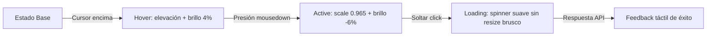

# Ingeniería de Diseño Frontend: Estándares de Emil Kowalski

Basado en las técnicas avanzadas de ingeniería de interacción de **Emil Kowalski** ([github.com/emilkowalski/skills](https://github.com/emilkowalski/skills) y [animations.dev](https://animations.dev/)). Proporciona las reglas y métricas deterministas para transformar prototipos estáticos en aplicaciones web que se sienten tangibles, receptivas y fluidas como en Apple, Linear, Raycast y Vercel.

---

## 1. Repositorio Oficial y Recursos
* **Repositorio GitHub**: [github.com/emilkowalski/skills](https://github.com/emilkowalski/skills)
* **Plataforma Educativa de Animación**: [animations.dev](https://animations.dev/)
* **Directivas Hermanas**:
  - Parámetros de física de resortes: [`../animation-vocabulary/SKILL.md`](../animation-vocabulary/SKILL.md)
  - Control de interrupciones en tiempo real: [`../interruptible-animation/SKILL.md`](../interruptible-animation/SKILL.md)

---

## 2. Las 4 Leyes de la Ingeniería de Interacción

### Ley 1: Presupuesto de Latencia (<16ms)
Cualquier interacción directa (clic, toque, arrastre) debe reflejar un cambio visual en el **siguiente frame de refresco (menor a 16.6ms en pantallas de 60Hz, y 8.3ms en pantallas de 120Hz ProMotion)**.
- Nunca esperar una respuesta de red o una promesa para iniciar la animación visual.
- La respuesta optimista debe dispararse de forma síncrona.

### Ley 2: Espectro de Duración y Jerarquía Temporal
- **Microinteracciones inmediatas** (botones, toggles, checkboxes, tooltips): **80ms a 150ms**.
- **Despliegues locales** (menús contextuales, popovers, selectores): **160ms a 240ms**.
- **Paneles y Modales** (drawers laterales, modales centrados): **260ms a 340ms**.
- **Navegación de página completa**: **300ms a 400ms**.
- *Regla*: Cualquier animación que dure más de 400ms en una tarea frecuente frustra al usuario y se percibe como lenta.

### Ley 3: Respuesta Táctil al Presionar (*Scale on Press*)
Los elementos interactivos deben simular deformación física al ser presionados, confirmando inmediatamente la acción antes de que el usuario levante el dedo o el mouse:

```css
/* Botón con respuesta táctil instantánea */
.btn-tactile {
  transition: transform 0.08s cubic-bezier(0, 0, 0.2, 1), filter 0.08s ease;
  will-change: transform;
}

.btn-tactile:active {
  transform: scale(0.965);
  filter: brightness(0.94);
}

/* En tarjetas interactivas */
.card-tactile:active {
  transform: scale(0.985);
}
```

### Ley 4: Transiciones Asimétricas (Entrada Lenta, Salida Rápida)
Los elementos que entran a la pantalla deben hacerlo con elegancia para que el ojo humano los registre (`ease-out` en ~250ms). Los elementos que salen deben desaparecer con el doble de rapidez (`ease-in` en ~120ms) para no estorbar el siguiente paso del usuario.

---

## 3. Coordinación Rigurosa de Estados de UI



### Directrices de Estados:
1. **Focus-Visible de Alta Precisión**:
   ```css
   :focus-visible {
     outline: 2px solid var(--accent-color);
     outline-offset: 2px;
   }
   ```
   Separar siempre el anillo de foco por 2 píxeles (`outline-offset: 2px`) para que no se superponga con el borde del elemento.
2. **Prevención de Saltos de Layout al Cargar**:
   Al mostrar un estado de carga en un botón, nunca reemplazar el texto bruscamente cambiando el ancho del botón. Mantener el ancho reservado o animar la propiedad de layout suavemente.

---

## 4. Métricas de Rendimiento en Runtime
* **Propiedades Permitidas**: Modificar únicamente `transform` y `opacity`.
* **Zero Layout Thrashing**: Jamás leer propiedades geométricas (`offsetHeight`, `clientWidth`, `getBoundingClientRect`) inmediatamente después de escribir en el DOM dentro de bucles de animación.
* **Aceleración por GPU**: Declarar `will-change: transform` durante la interacción y removerlo al reposar para no agotar la memoria de texturas del navegador.
